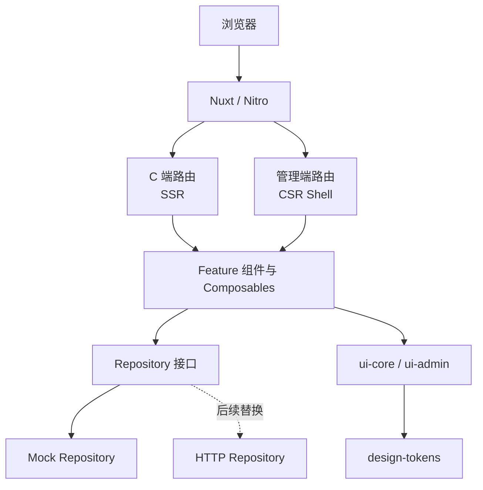
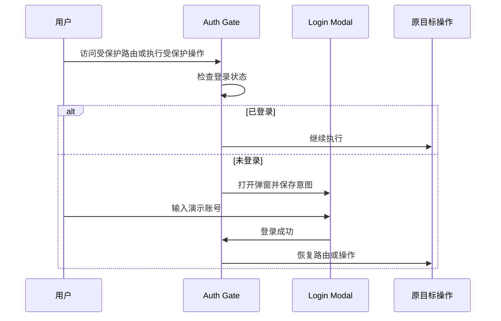

# isport-college 前端架构设计

> 状态：已确认的首版架构基线  
> 更新日期：2026-09-18  
> 适用范围：C 端门户与管理端前端

## 1. 背景与目标

项目同时面向两类用户：

- C 端用户使用公开门户，需要服务端渲染、搜索引擎友好和完整的移动端体验。
- 管理用户使用中后台，需要登录后访问，不允许被搜索引擎收录，并同时支持 PC 与移动端。

首期没有真实后端 API，以完整前端体验和可替换的 Mock 数据层为主。后续接入真实服务时，应尽量不修改页面组件和业务组件。

### 1.1 架构目标

- 使用 Monorepo 管理应用、组件、设计令牌和工程配置。
- 最终只产生一个 Nuxt 发布产物和一个服务入口。
- C 端默认 SSR，管理端路由采用 CSR。
- C 端和管理端共用设计语言，但不强制共用全部业务组件。
- 支持中文和英文。
- PC、平板和移动端均可使用。
- 前端 Mock 登录和数据层可平滑替换为真实后端实现。
- 保持类型安全、模块边界清晰，并具备基本测试和质量门禁。

### 1.2 首期非目标

- 不提供真实身份认证或安全授权。
- 不实现真实数据库、服务端业务逻辑和生产级用户数据存储。
- 不承诺 Chrome 88 等旧版本浏览器兼容性。
- 不在首期实现微前端、多个独立部署单元或复杂多租户架构。

## 2. 技术栈

| 分类     | 选型                                  | 用途                                       |
| -------- | ------------------------------------- | ------------------------------------------ |
| Monorepo | pnpm workspace + Turborepo            | 依赖管理、任务编排和构建缓存               |
| 应用框架 | Nuxt 4                                | SSR、CSR、路由、Nitro 服务与统一构建产物   |
| UI 框架  | Vue 3                                 | Composition API 与组件体系                 |
| 语言     | TypeScript                            | 应用、组件、配置和 Mock 数据类型           |
| 路由     | Nuxt Pages / Vue Router               | 文件路由、路由中间件和导航                 |
| 状态管理 | Pinia                                 | 登录态、用户偏好及跨页面 UI 状态           |
| 原子样式 | UnoCSS                                | 响应式布局、原子类和设计令牌消费           |
| 组件库   | antdv-next                            | 表单、表格、弹窗等通用组件，管理端优先使用 |
| 国际化   | @nuxtjs/i18n / vue-i18n               | 中英文路由和文案                           |
| 日期时间 | dayjs                                 | 日期解析、格式化、语言和时区处理           |
| 测试     | Vitest + Nuxt Test Utils + Playwright | 单元、组件、Nuxt 集成和端到端测试          |

依赖必须通过根目录锁文件固定版本。`antdv-next` 等更新较快的依赖不得在 CI 中隐式升级。

## 3. 总体架构

项目采用“单 Nuxt 应用 + 路由级混合渲染”的结构。



### 3.1 为什么使用一个 Nuxt 应用

- C 端 SSR 与管理端 CSR 可以通过 Nuxt `routeRules` 同时实现。
- 只生成一个 `.output`，部署时只启动一个 Nitro 服务。
- 登录状态、国际化、设计令牌和 Mock 数据无需在两个应用间重复配置。
- 首期业务规模尚不需要独立发布和团队隔离。
- 将来管理端需要独立域名或发布节奏时，可以再从 `/admin` 路由分区提取为独立应用。

## 4. Monorepo 目录规划

```text
.
├── apps/
│   └── portal/
│       ├── app/
│       │   ├── assets/
│       │   ├── components/
│       │   │   ├── app/
│       │   │   ├── auth/
│       │   │   └── features/
│       │   ├── composables/
│       │   ├── layouts/
│       │   │   ├── default.vue
│       │   │   └── admin.vue
│       │   ├── middleware/
│       │   ├── pages/
│       │   │   ├── index.vue
│       │   │   └── admin/
│       │   ├── plugins/
│       │   ├── stores/
│       │   ├── app.vue
│       │   └── error.vue
│       ├── public/
│       ├── server/
│       ├── nuxt.config.ts
│       └── package.json
├── packages/
│   ├── api-client/
│   ├── design-tokens/
│   ├── i18n/
│   ├── mock-data/
│   ├── shared/
│   ├── ui-core/
│   ├── ui-admin/
│   ├── unocss-preset/
│   ├── eslint-config/
│   └── tsconfig/
├── docs/
│   └── architecture.md
├── scripts/
├── package.json
├── pnpm-workspace.yaml
└── turbo.json
```

### 4.1 包职责

| 包              | 职责                                                 | 不应包含                 |
| --------------- | ---------------------------------------------------- | ------------------------ |
| `design-tokens` | 颜色、字号、间距、圆角、阴影、断点及主题映射         | 页面业务逻辑             |
| `unocss-preset` | 将设计令牌映射为 UnoCSS theme、shortcuts 和 rules    | antdv-next 业务封装      |
| `ui-core`       | 两端共享的品牌基础组件和无业务展示组件               | 路由、页面请求和全局状态 |
| `ui-admin`      | antdv-next 二次封装和管理端组合组件                  | C 端页面逻辑             |
| `api-client`    | DTO、Repository 接口、Mock/HTTP 适配器和统一错误模型 | 具体页面状态             |
| `mock-data`     | Fixtures、数据工厂和演示数据                         | Vue 组件                 |
| `i18n`          | 中英文公共语言包、locale 类型和格式化约定            | 组件实现                 |
| `shared`        | 纯 TypeScript 类型、常量和工具函数                   | Vue/Nuxt 生命周期依赖    |

### 4.2 依赖方向

依赖必须保持单向：

```text
portal
├── ui-core ────────┐
├── ui-admin ───────┼──> design-tokens / shared
├── api-client ─────┤
└── i18n ───────────┘

api-client --> mock-data
```

底层包不得反向依赖 `apps/portal`。`shared` 不得引入 Vue、Nuxt、Pinia 或浏览器专属 API。

## 5. 渲染与路由策略

### 5.1 C 端

- 默认使用 SSR。
- 首页、公开列表、公开详情和搜索落地页可被搜索引擎访问。
- 后续可针对内容稳定的页面增加 `prerender`、`swr` 或 `isr`。
- 用户个性化区域使用客户端状态，不将敏感信息写入公共缓存。

### 5.2 管理端

- `/admin` 及其子路由使用 CSR。
- 英文管理端 `/en/admin` 及其子路由同样使用 CSR。
- 管理端页面组件不参与服务端渲染。
- 未登录访问时保留目标地址并打开登录弹窗。
- 登录成功后继续进入目标页面。

### 5.3 Nuxt 路由规则

```ts
export default defineNuxtConfig({
  routeRules: {
    '/admin': {
      ssr: false,
      headers: {
        'X-Robots-Tag': 'noindex, nofollow, noarchive',
      },
    },
    '/admin/**': {
      ssr: false,
      headers: {
        'X-Robots-Tag': 'noindex, nofollow, noarchive',
      },
    },
    '/en/admin': {
      ssr: false,
      headers: {
        'X-Robots-Tag': 'noindex, nofollow, noarchive',
      },
    },
    '/en/admin/**': {
      ssr: false,
      headers: {
        'X-Robots-Tag': 'noindex, nofollow, noarchive',
      },
    },
  },
})
```

C 端 SSR 是 Nuxt 默认行为，无需再配置全局 `/**: { ssr: true }`。

### 5.4 禁止管理端被收录

管理端同时使用以下措施：

- Route Rules 返回 `X-Robots-Tag: noindex, nofollow, noarchive`。
- 管理端布局通过 `useSeoMeta` 输出等价的 robots Meta。
- `robots.txt` 禁止抓取 `/admin` 和 `/en/admin`。
- 所有管理功能经过登录和权限检查。
- 测试、预发环境默认全站禁止收录。

`robots.txt` 和 `noindex` 不是安全措施。接入真实后端后，所有管理接口必须由服务端执行身份认证和权限校验。

## 6. 国际化

### 6.1 Locale

| Locale  | 说明     | 默认 |
| ------- | -------- | ---- |
| `zh-CN` | 简体中文 | 是   |
| `en-US` | 英文     | 否   |

### 6.2 URL 策略

统一使用 `prefix_except_default`：

```text
/                     中文 C 端首页
/courses              中文 C 端页面
/en/                   英文 C 端首页
/en/courses            英文 C 端页面
/admin                 中文管理端
/en/admin              英文管理端
```

这样可以保证中英文公开页面具有独立 URL、canonical 和 hreflang。管理端虽然不参与 SEO，但继续使用相同的路由规则可以避免在一个 Nuxt 应用中维护两套语言状态机制。

### 6.3 文案和日期

- 页面和组件中不得直接硬编码用户可见文案。
- 语言包按 Locale 懒加载。
- `html[lang]`、antdv-next Locale 和 dayjs Locale 必须同步切换。
- 日期数据统一以 ISO 8601 传递和存储，展示时按当前语言和浏览器时区格式化。
- 语言偏好使用 Cookie 保存，确保 SSR 首屏语言与客户端一致。

## 7. 登录与访问控制

### 7.1 演示账号

```text
手机号：188 8888 8888
密码：123456
```

输入校验前先移除手机号中的空格，因此以下输入都有效：

```text
188 8888 8888
18888888888
```

该账号仅用于前端原型。固定凭证会出现在浏览器构建产物中，不具备任何安全性。

### 7.2 登录状态

- Mock 用户默认同时拥有 C 端用户和管理员演示角色。
- 登录状态通过 Cookie 保存，默认有效期 7 天。
- Pinia Auth Store 负责内存中的用户、角色和登录状态。
- Cookie 是 SSR 与客户端共享登录状态的来源，但首期仍可被用户自行伪造。
- 提供显式退出登录，并清理 Cookie 与内存状态。

### 7.3 全局登录弹窗

全局只挂载一个 `LoginModal`，避免每个页面重复创建弹窗和状态。

```text
AppShell
├── NuxtLayout
├── NuxtPage
└── LoginModalProvider
```

登录门禁包含两类入口：

1. 路由门禁：访问管理端、个人中心等受保护页面时触发。
2. 操作门禁：收藏、报名、提交或管理操作执行前触发。

推荐统一通过 `useAuthGate()` 调用：

```ts
await requireAuth({
  reason: 'enroll',
  onSuccess: () => enroll(),
})
```

流程如下：



PC 端使用居中弹窗；移动端使用接近全屏的响应式弹窗。关闭登录弹窗表示取消当前受保护操作。

## 8. 状态管理

### 8.1 Pinia 适用范围

Pinia 用于：

- 当前用户和登录状态。
- 语言、主题、导航折叠等用户偏好。
- 跨页面共享且有明确生命周期的 UI 状态。
- 需要恢复的短期业务草稿。

Pinia 不用于：

- 无条件保存所有列表和详情响应。
- 替代 Repository 或服务端数据缓存。
- 存放可以由现有状态计算出的重复数据。

状态保持最小化，派生数据使用 `computed`。Watch 只承担副作用，不承担派生状态计算。

### 8.2 SSR 约束

- 不在模块顶层创建跨请求共享的可变单例状态。
- 不在 SSR 初始渲染中直接读取 `window`、`document` 或 `localStorage`。
- Cookie 通过 Nuxt `useCookie` 读取。
- 仅客户端持久化的数据在 mounted 后恢复，并避免引起首屏 Hydration 不一致。

## 9. 数据访问与 Mock 架构

### 9.1 Repository 模式

页面和组件只依赖 Repository 接口，不直接依赖 Mock 数据，也不直接拼接 HTTP URL。

```ts
export interface CourseRepository {
  list(query: CourseListQuery): Promise<PageResult<Course>>
  getById(id: string): Promise<CourseDetail>
  enroll(id: string): Promise<void>
}
```

首期实现：

```text
CourseRepository
└── MockCourseRepository
```

接入后端后新增：

```text
CourseRepository
├── MockCourseRepository
└── HttpCourseRepository
```

通过 Nuxt Plugin 或依赖注入决定当前实现，页面代码不感知数据来自 Mock 还是真实 API。

### 9.2 Mock 能力

- 提供稳定、可重复的数据 Fixtures。
- 可配置请求延迟。
- 支持正常、空数据、校验失败和服务失败场景。
- 查询、分页和筛选行为与未来 API 约定保持一致。
- 用户产生的演示数据可在客户端持久化，但不得影响 SSR 初始输出。
- 测试环境允许固定随机种子，保证快照和 E2E 可重复。

### 9.3 未来 API 接入原则

- 优先使用 OpenAPI 生成请求 DTO 和响应类型。
- 统一错误模型、分页模型、认证头和取消请求机制。
- 用户权限由后端判定，前端权限仅控制展示和交互。
- API Base URL 通过 `runtimeConfig.public` 注入，不写死在源码中。

## 10. 组件与代码组织

### 10.1 Vue 编码基线

- 使用 Vue 3 Composition API。
- SFC 默认使用 `<script setup lang="ts">`。
- SFC 顺序统一为 `<script>`、`<template>`、`<style>`。
- Props 向下、Events 向上，组件公共契约必须类型化。
- 复杂状态和副作用放入专注的 Composable。
- 页面组件只负责路由级编排，不承载大段业务实现。
- 不可信内容不得直接通过 `v-html` 渲染。

### 10.2 Feature 目录

非简单功能按 Feature 组织：

```text
components/features/course/
├── CourseFeature.vue
├── CourseFilters.vue
├── CourseList.vue
├── CourseCard.vue
└── CourseEmptyState.vue

composables/course/
├── useCourseList.ts
└── useCourseEnrollment.ts
```

路由页面保持轻量：

```vue
<script setup lang="ts">
import CourseFeature from '~/components/features/course/CourseFeature.vue'
</script>

<template>
  <CourseFeature />
</template>
```

### 10.3 antdv-next 使用边界

- 管理端优先使用 antdv-next，并通过 `ui-admin` 二次封装常用模式。
- C 端可使用基础表单、弹窗等组件，但品牌展示组件优先放在 `ui-core`。
- 业务代码不得大量使用 `:deep()` 覆盖组件库内部样式。
- 主题调整优先通过设计令牌和 ConfigProvider 完成。
- 静态 Message、Modal、Notification 必须确保能够获取当前主题和 Locale 上下文。

## 11. 设计令牌与样式系统

### 11.1 单一来源

`packages/design-tokens` 是样式值的唯一来源，至少包含：

- 品牌色和语义色。
- 文本与背景色。
- 字号、字重和行高。
- 间距阶梯。
- 圆角和阴影。
- Z-Index 层级。
- 响应式断点。
- 动效时长与缓动。

同一份令牌生成或导出：

```text
tokens.ts
css-vars.css
antdv-theme.ts
uno-theme.ts
tokens.json
```

UnoCSS 与 antdv-next 不得各自维护一套重复的品牌色和间距值。

### 11.2 样式优先级

1. 设计令牌。
2. UnoCSS Utilities 和项目级 Shortcuts。
3. antdv-next 组件 Token。
4. 组件局部 `<style scoped>`。
5. 极少数经过说明的深层覆盖。

禁止在页面中散落无法解释的颜色、字号、间距和 Z-Index 魔法数字。

## 12. 响应式设计

### 12.1 默认断点

| 名称  | 最小宽度 | 用途     |
| ----- | -------: | -------- |
| `xs`  |        0 | 小屏手机 |
| `sm`  |    640px | 大屏手机 |
| `md`  |    768px | 平板     |
| `lg`  |   1024px | 小型桌面 |
| `xl`  |   1280px | 标准桌面 |
| `2xl` |   1536px | 大屏桌面 |

断点由设计令牌提供，并映射到 UnoCSS。组件不得自行定义互相冲突的断点体系。

### 12.2 C 端

- Mobile First。
- 内容宽度、留白、字号和图片比例随断点变化。
- 触控目标尺寸原则上不小于 44×44px。
- 首屏内容优先，非关键模块和图片延迟加载。
- 不以单纯缩放桌面页面代替移动端布局。

### 12.3 管理端

- 桌面侧边导航在移动端变为抽屉。
- 多列表单在移动端变为单列。
- 表格根据业务选择关键列、卡片列表或横向滚动。
- 固定操作区必须避开移动端安全区域。
- 居中弹窗在窄屏下变为接近全屏。
- PC 和移动端功能一致，允许呈现方式不同。

## 13. 浏览器策略

- 支持 Chrome、Edge、Firefox 和 Safari 的近期稳定版本。
- 移动端覆盖近期 iOS Safari、Android Chrome 和主流 WebView。
- Chrome 88 不是硬性兼容目标。
- 不默认引入旧浏览器 Polyfill 和 Legacy Bundle。
- 每次升级 Nuxt、Vite、UnoCSS 或 antdv-next 后执行关键路径 E2E 回归。

精确浏览器版本矩阵应在上线前根据真实用户数据补充。

## 14. 构建与发布

### 14.1 Turbo 任务

根任务建议包括：

```text
dev
build
lint
typecheck
test
test:e2e
```

`build` 依赖上游包构建，缓存输出包括包产物和 Nuxt `.output`。`dev` 为持久任务，不使用缓存。

### 14.2 构建产物

根目录执行：

```bash
pnpm build
```

Nuxt 原始产物：

```text
apps/portal/.output/
├── public/
├── server/
│   └── index.mjs
└── nitro.json
```

发布聚合脚本将其复制为统一目录：

```text
dist/
├── public/
├── server/
│   └── index.mjs
└── nitro.json
```

生产启动命令：

```bash
NODE_ENV=production node dist/server/index.mjs
```

`dist` 是唯一需要部署的应用目录。运行环境仍需提供兼容版本的 Node.js 和必要环境变量。

### 14.3 发布约束

- 不使用 `nuxt generate` 作为最终发布方式，因为 C 端需要运行时 SSR 和路由级混合渲染。
- 构建产物不得包含源码 `.env` 文件。
- 私密配置只能放在服务端 Runtime Config；`runtimeConfig.public` 中的值会暴露给浏览器。
- 静态资源可通过 CDN 提供，但 HTML SSR 请求仍进入 Nitro 服务。

## 15. 测试与质量门禁

### 15.1 测试分层

| 层级      | 工具                    | 重点                                      |
| --------- | ----------------------- | ----------------------------------------- |
| 单元测试  | Vitest                  | 工具函数、Store、Composable 和 Repository |
| 组件测试  | Vitest + Vue Test Utils | Props、Events、表单和响应式状态           |
| Nuxt 测试 | Nuxt Test Utils         | Middleware、Plugin、SSR 和路由配置        |
| E2E       | Playwright              | 登录门禁、中英文、C 端和管理端关键路径    |
| 视觉回归  | Playwright Screenshot   | 关键页面在桌面和移动端的布局              |

### 15.2 合并前检查

```text
lint
typecheck
unit test
Nuxt build
关键 E2E
```

至少覆盖以下场景：

- 中英文 C 端页面可以 SSR。
- `/admin` 和 `/en/admin` 不输出业务 SSR 内容。
- 管理端响应包含禁止索引 Header。
- 未登录访问受保护页面会打开登录弹窗。
- 使用固定账号登录后恢复原导航或操作。
- PC 和移动端导航、表格、表单及弹窗可用。
- 刷新后能够恢复 Mock 登录状态。

## 16. 安全基线

即使首期没有真实后端，仍需遵守以下前端基线：

- 不在客户端代码中放置真实密钥。
- 用户输入默认按文本渲染。
- 富文本必须经过可信白名单清洗。
- 外部链接使用必要的 `rel` 属性。
- Cookie 在生产接入后端时使用合适的 `Secure`、`HttpOnly` 和 `SameSite` 策略。
- 后续真实接口必须处理 CSRF、XSS、越权和重放风险。
- 管理端是否显示按钮不能代替服务端权限校验。

演示手机号和密码是公开测试数据，不得沿用到生产环境。

## 17. 可观测性与性能

### 17.1 性能原则

- 路由级代码分割。
- 大型、低频组件异步加载。
- 图片使用合适尺寸、现代格式和懒加载。
- C 端减少首屏 JavaScript，避免将管理端组件引入公共页面入口。
- 大数据表格和列表在确认瓶颈后使用虚拟滚动。
- 性能优化以真实测量结果为依据。

### 17.2 后续生产能力

接入生产环境前补充：

- 前端异常采集。
- Nitro 服务错误与结构化日志。
- Web Vitals 和页面性能监控。
- 发布版本号与 Source Map 管理。
- 接口错误率和关键业务转化埋点。

## 18. 分阶段实施计划

### 阶段一：工程骨架

- 初始化 pnpm workspace 和 Turbo。
- 创建 `apps/portal` Nuxt 4 应用。
- 创建共享包和依赖边界。
- 配置 TypeScript、ESLint、UnoCSS、Pinia、i18n 和 antdv-next。
- 配置 SSR/CSR Route Rules 和统一构建产物。

### 阶段二：设计系统与应用外壳

- 建立基础设计令牌。
- 完成 C 端和管理端 Layout。
- 完成桌面与移动端导航。
- 完成语言切换和基础 SEO。
- 完成全局登录弹窗和 Auth Gate。

### 阶段三：Mock 数据与首批页面

- 定义业务实体和 Repository 接口。
- 建立 Mock Repository 和 Fixtures。
- 根据页面清单实现 C 端功能。
- 根据管理模块清单实现管理端功能。

### 阶段四：质量和发布

- 补齐单元、集成和 E2E 测试。
- 验证中英文和响应式页面。
- 验证 SEO 与管理端禁止收录策略。
- 输出 `dist` 单目录发布产物。

## 19. 待补充产品决策

以下内容不阻塞工程骨架，但会影响业务实现：

- C 端页面和功能清单。
- 管理端模块和增删改查范围。
- 公开页面、受保护页面和受保护操作清单。
- 产品名称、Logo、品牌色及视觉参考。
- 是否需要深色主题或多品牌主题。
- Mock 数据是否要求跨浏览器会话长期保存。
- SEO 页面、站点地图和结构化数据范围。
- 上线环境、域名、CDN 和 Node.js 托管方式。
- 真实 API 的协议、认证模式和错误码规范。

## 20. 已确认架构决策摘要

| 决策       | 结论                                            |
| ---------- | ----------------------------------------------- |
| 应用数量   | 一个 Nuxt 4 应用 `apps/portal`                  |
| 构建产物   | 一个 `.output`，聚合为根目录 `dist`             |
| C 端渲染   | SSR，后续按页面增加缓存或预渲染                 |
| 管理端渲染 | `/admin` 与 `/en/admin` 使用 CSR                |
| 管理端索引 | Header、Meta、robots 和登录门禁多层限制         |
| 响应式     | C 端和管理端均完整支持移动端和 PC 端            |
| 国际化     | `zh-CN`、`en-US`，中文默认，URL 前缀策略        |
| 登录       | 全局弹窗，固定演示手机号和密码，Cookie 保存状态 |
| 后端       | 首期无真实后端，使用可替换的 Mock Repository    |
| 设计系统   | UnoCSS 与 antdv-next 共用单一设计令牌来源       |
| 浏览器     | 现代浏览器近期稳定版本，不强制支持 Chrome 88    |

## 21. 工程配置约束

- Node.js 统一使用 24，最低版本为 24.11.0。
- 仓库只保留根目录一个 `eslint.config.mjs`，应用和包不得复制独立配置。
- 纯 TypeScript 包继承 `@isport/tsconfig/base.json`；浏览器和 Vue 包继承 `browser.json`。
- `shared` 不允许导入 Vue、Nuxt、Pinia，也不允许访问浏览器全局对象。
- 任意 CI 平台统一执行 `pnpm check:ci`；本项目不维护 `.github/workflows`。
- 普通单测不声明缓存产物，覆盖率由 `pnpm test:coverage` 独立生成。
