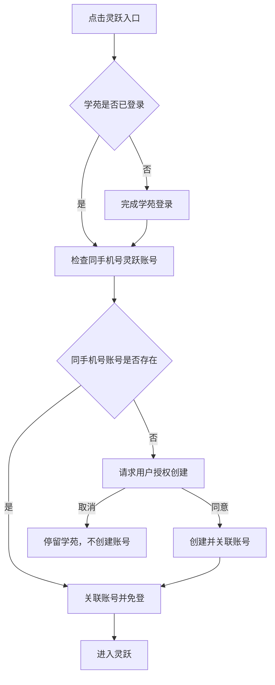

# 融梦体育学苑产品需求文档

> 文档性质：依据飞书需求与本地交互原型汇编的产品基线，不代表功能已在本仓库实现。  
> 整理日期：2026-09-22  
> 当前范围：v1.0 / P0；P1 单独列示，不纳入 P0 验收。  
> 面向人员：产品、设计、前后端研发、测试与内容运营。

## 1. 来源、优先级与阅读约定

### 1.1 资料来源

| 编号 | 来源                                                                                                | 本次读取版本                                                                        | 用途                           |
| ---- | --------------------------------------------------------------------------------------------------- | ----------------------------------------------------------------------------------- | ------------------------------ |
| S1   | [融梦学苑 P0 产品需求文档](https://hsuhdec6va.feishu.cn/docx/By8ndzlQ2oKaUSxfiWUcGhadnKe)           | revision 199                                                                        | P0 范围、业务规则与验收依据    |
| S2   | [融梦学苑网站｜模块功能清单与优先级](https://hsuhdec6va.feishu.cn/docx/VXTqdPT8Lowo3hxj3Z5cchewnic) | revision 461                                                                        | P0/P1 划分、后续模块及依赖     |
| S3   | 本地参考包 `/Users/dddd/Downloads/rongmeng-academy-v2`                                              | README 标注打包日期 2026-09-21，源码版本 `38f8635c59b625894fc5d381e0d5354bf4a75c19` | 页面结构、交互示例与视觉参考   |
| S4   | [前端架构设计](./architecture.md)                                                                   | 文档标注更新日期 2026-09-19                                                         | 本仓库工程约束与 Mock 阶段边界 |

S1、S2 已读取全文；S3 已核对总览、P0 页面及相关交互脚本。本地版本信息取自参考包 README，未核验线上源码是否仍为同一版本。本文不是飞书文档逐字备份；后续线上需求变更需要重新同步。

### 1.2 采用规则

- P0 具体行为以 S1 为主；模块优先级与明确排除项结合 S2。
- S3 用于补充页面和交互细节，不能将原型已有功能自动认定为 P0。
- S4 约束工程实现方式，但其中的固定账号、Mock 数据不代替正式产品的短信登录、真实内容与灵跃对接要求。
- 本文使用“已明确”表示 S1/S2 明确要求；“原型参考”表示仅由 S3 补充；“待确认”表示资料尚不足以形成最终决策。
- 验收清单包含依据既有规则展开的边界场景，不表示原型或当前仓库已通过这些检查。
- 资料冲突与待确认项分别记录在第 12、14 节，不以静默取舍掩盖差异。

### 1.3 原型访问

- 交接包入口：`all-pages.html`；业务首页：`index.html`。
- 总览中 `v1.0 / P0` 为首期页面，`v1.1` 为后续参考，其中教师资料单独标注 P1。
- 参考包 README 提供[线上总览](https://rongmeng-academy-v2-preview.geqijing.chatgpt.site/all-pages)，本文未将其视为已核验的最新页面快照。
- S1 中的 `http://127.0.0.1:4173/...` 是本机预览地址，不是对外发布地址。应先按参考包 README 启动本地服务，再使用实际端口访问。
- `all-pages.html`、`all-pages-auth.html` 是交接展示工具，不属于正式产品页面。

### 1.4 本轮开发范围补充

用户已确认同时开发 P0 与 P1 的前端 Mock 版本，P1 仍在 P0 验收后单独开放。以下是演示交付边界，不删除或替代后文正式产品需求：

- 暂无后台，账号、内容、投稿、审核、积分、运营通过 Nitro 同源 Mock 接口与本地持久化演示，不接入真实测试服务。
- PPT／PPTX 仅展示文件信息和“暂不支持预览”；原 AC-13 的 PPT 能力与 AC-14 延期，不标记通过。视频、音频、图片与 PDF 仍使用实际本地素材验证。
- 短信明确标记未真实发送；灵跃只进入站内模拟结果；AI 预检和兑换均不调用外部服务。真实免登验收仍需后续联调。
- 开发默认 P0，创作九入口保持占位且不产生积分；P1 写操作在服务端受阶段与角色限制。
- 演示奖励、上传限制、兑换档位和有效期集中配置，不代表正式商业规则。非生产保持 noindex，生产站点禁止启用 Mock。

## 2. 产品定位与用户

### 2.1 产品定位

融梦体育学苑（原型英文标识：DREAM SPORTS ACADEMY）是面向体育教师的专业内容与成长平台，连接高校、教研机构、一线名师与学校实践，服务备课、课堂教学、教研学习和经验分享。

P0 的主要使用路径为：发现内容 → 查看资源或案例 → 登录并收藏／点赞 → 从“我的账号”再次访问；同时提供灵跃 AI 工具入口与创作中心概览。

### 2.2 用户与职责

| 用户         | 核心诉求                             | 本期边界                              |
| ------------ | ------------------------------------ | ------------------------------------- |
| 游客         | 查找教学资源、阅读案例、了解平台     | 公开浏览；互动及个人数据需要登录      |
| 已登录教师   | 收藏、点赞、管理昵称头像、使用灵跃   | P0 核心账号能力，不要求提交教师资料   |
| 内容创作者   | 分享教学成果、查看作品、获得积分     | P0 仅概览；投稿、作品管理和积分为 P1  |
| 审核人员     | 检查投稿、通过或拒绝、查看预检结果   | P1，不因本仓库已有管理端架构而计入 P0 |
| 内容运营人员 | 维护内容、配置分类推荐、处理问题内容 | P1；P0 内容供给方式需另行明确         |

以上是业务角色描述，不代表已确定后端角色枚举、权限编码或组织关系。

### 2.3 成功标准

- PC 与手机端均能完成 P0 核心路径。
- 公开浏览不被登录打断，受保护操作具有明确登录入口。
- 详情、个人列表中的点赞／收藏状态和数量一致。
- 已失效内容不继续出现在列表、推荐及个人收藏／点赞中。
- P0 创作入口不误导用户进入未开放的投稿、审核或积分流程。
- 正式 P0 的灵跃关联与免登可用；仅打开外链或完成本地授权演示不算对接完成。

资料未提供 DAU、转化率、性能数值或营收目标，本文不新增量化承诺。

## 3. 版本范围

### 3.1 P0 必须交付

| 编号  | 模块           | 范围                                               | 依据                   |
| ----- | -------------- | -------------------------------------------------- | ---------------------- |
| P0-01 | 首页及通用导航 | 核心内容展示、栏目入口、PC／手机适配               | S1 §1、S2 首页         |
| P0-02 | 注册与登录     | 手机号短信验证码、协议同意、首次昵称引导、退出确认 | S1 §2                  |
| P0-03 | 教学资源库     | 复用现有资源平台能力，排除添加功能                 | S1 §3、S2 教学资源库   |
| P0-04 | 资源详情       | 视频、图片、音频／音乐、PDF、PPT 预览              | S1 §3、S2 二级页面     |
| P0-05 | 教研中心       | 列表，视频／图文详情及外部链接                     | S1 §1、§3，S2 教研中心 |
| P0-06 | 学校案例       | 列表，图文详情及外部链接                           | S1 §1、§3，S2 学校案例 |
| P0-07 | 浏览与互动     | 浏览计数、独立点赞／收藏关系、推荐及失效处理       | S1 §4                  |
| P0-08 | 我的账号       | 昵称、固定头像选择、我的收藏／我的点赞             | S1 §5                  |
| P0-09 | 创作中心概览   | 公开概览及统一“敬请期待”反馈                       | S1 §6                  |
| P0-10 | 灵跃账号对接   | 按点击触发账号关联、授权创建与免登，不处理积分     | S1 §7                  |

“音频／音乐”在功能清单中分别出现；本文归入同一播放模板，不代表最终资源字典可以删除“音乐”类型，数据分类仍需确认。

### 3.2 不纳入 P0

- 教师资料提交、教师身份认证与资料奖励。
- 实际投稿、文件上传、图文编辑、草稿、审核及已发布作品管理。
- 积分获取、兑换、有效期、余额流水及灵跃积分接口。
- 首页“教师共创精选”的真实投稿推荐业务（S2 明确 P1）。
- 学苑资源审核后台、AI 预检、内容运营平台、举报处理、数据埋点。
- 资源“添加”功能；S2 已划除的前台举报不作为 P0 验收项。
- 原型名师故事、行业动态详情、教学实践专区、专区总览、运动项目专区、赛事活动专区等后续独立页面。

首页仍出现的名师、行业动态等展示区是否保留，见待确认项；展示区出现不自动扩大独立详情页范围。

## 4. 信息架构与页面清单

### 4.1 导航结构

```text
融梦体育学苑
├── 首页
├── 教学资源
│   └── 视频／图片／音频／PDF／PPT 详情
├── 教研中心
│   ├── 教学实践
│   ├── 教研与专业发展
│   ├── 赛事与主题活动
│   └── 产品教程
├── 学校案例
│   ├── 校本课程建设
│   └── 数字化课堂实践
├── 我的账号（需登录）
│   ├── 个人信息
│   ├── 我的收藏
│   └── 我的点赞
├── 创作中心（P0 仅公开概览）
└── 灵跃 AI 助手（外部系统，点击时处理账号关联）
```

### 4.2 原型页面对照

下列是参考包文件名，不是对 Nuxt 路由命名的最终约定。图文模板必须按实际所属栏目显示导航、分类与互动归属。

| 页面／状态         | S3 入口                                               | 访问条件     | 说明                               |
| ------------------ | ----------------------------------------------------- | ------------ | ---------------------------------- |
| 首页               | `index.html`                                          | 公开         | 核心栏目与内容入口                 |
| 登录弹窗           | 公共账号入口；总览用 `all-pages-auth.html?step=login` | 未登录       | 使用全局弹窗                       |
| 首次昵称引导       | `all-pages-auth.html?step=nickname`                   | 新用户已登录 | 可关闭、可跳过                     |
| 教学资源列表       | `resources.html`                                      | 公开         | 搜索、分类与组合筛选               |
| 视频／图片详情参考 | `resource-detail.html?type=video`                     | 公开         | 原型实际没有独立图片预览实现       |
| 音频详情           | `resource-detail.html?type=audio`                     | 公开         | 播放器与播放动效                   |
| PPT／PDF 详情参考  | `resource-detail.html?type=pdf`                       | 公开         | 原型为排版示例，不是真实文件解析   |
| 教研中心列表       | `courses.html?category=series`                        | 公开         | 四类内容切换                       |
| 共用图文详情参考   | `school-detail.html?id=large-class`                   | 公开         | 正式内容不能全部归类为学校案例     |
| 学校案例列表       | `schools.html`                                        | 公开         | 分类标签及“省份｜学校”副标题       |
| 个人信息与互动列表 | `profile-p0.html`                                     | 登录         | 一个页面容纳个人信息和两个互动 Tab |
| 创作中心概览       | `creation-p0.html`                                    | 公开         | 不接入原版投稿与积分逻辑           |

`profile.html`、`creation.html` 及 `creation-detail.html` 是后续能力参考，不能替代 P0 专用页面。原型部分导航仍链接到 `creation.html`，迁移时须统一指向 P0 概览。

### 4.3 登录权限矩阵

| 行为                           | 游客                           | 已登录用户     |
| ------------------------------ | ------------------------------ | -------------- |
| 查看首页、列表、本站内容详情   | 允许                           | 允许           |
| 播放／阅读公开资源             | 允许                           | 允许           |
| 打开内容型外部链接             | 直接打开原地址，不提供本站互动 | 同游客         |
| 点赞／收藏本站内容             | 触发登录                       | 执行或取消操作 |
| 查看／修改我的账号             | 触发登录                       | 仅操作本人数据 |
| 查看创作中心概览、点击占位按钮 | 允许，仅提示“敬请期待”         | 同游客         |
| 进入灵跃                       | 先完成学苑登录，再处理关联     | 按关联状态继续 |

灵跃是有专门账号流程的外部系统，不按普通内容链接处理。

## 5. P0 页面与交互需求

### 5.1 首页与公共布局

已明确的首页核心内容包括学苑精选与热门资源、教学资源、水平专区、教研中心内容，以及各主要栏目入口。

| 区域                         | 内容与交互                                                                     | 范围说明                                             |
| ---------------------------- | ------------------------------------------------------------------------------ | ---------------------------------------------------- |
| 页头                         | 品牌返回首页；首页、教学资源、教研中心、学校案例导航；灵跃、创作中心、账号入口 | P0                                                   |
| 品牌介绍                     | 平台定位、教师成长价值、合作院校展示                                           | 原型参考，正式文案与授权需确认                       |
| 学苑精选                     | 封面、分类、标题、摘要、详情入口；缩略项及指示点切换                           | P0；推荐位内容需能正确打开                           |
| 热门资源                     | 资源名称、封面、类型、分类及详情入口                                           | P0；首页排序未规定为详情推荐算法                     |
| AI 工具入口                  | AI 教案、大单元设计、运动计划、体测报告                                        | 原型参考；统一进入灵跃对接流程，不在本站实现生成能力 |
| 教学资源                     | 体能、专项技能、基本技能、健康教育切换                                         | P0                                                   |
| 水平专区                     | 水平一至水平五切换与资源展示                                                   | P0；不擅自映射成具体年级规则                         |
| 教研中心                     | 四类教研内容切换与更多入口                                                     | P0                                                   |
| 学校案例                     | 案例封面、标题、摘要与更多入口                                                 | 原型参考，对应 P0 学校案例模块                       |
| 名师专栏、行业动态、服务数据 | 介绍卡片、动态轮播、统计展示                                                   | 原型存在，最终首页保留范围待确认                     |
| 教师共创精选                 | 已审核投稿中由运营挑选的首页展示                                               | S2 明确 P1                                           |
| 页脚                         | 联系方式、网站导航、公众号／视频号、版权                                       | 原型参考；正式信息及二维码需业务核验                 |

原型的精选自动轮播间隔为 5 秒，支持悬停／聚焦暂停、键盘切换和减少动态效果偏好；这些是交互参考，不是已冻结的定时参数。首页服务统计、学校和教师示例不能直接作为真实运营数据发布。

### 5.2 登录、注册与退出

#### 5.2.1 登录流程

1. 用户点击登录，或触发点赞、收藏、我的账号等受保护入口。
2. 展示手机号、短信验证码、获取验证码、协议勾选及登录按钮。
3. 用户须同意用户协议和隐私政策后登录；协议入口应可阅读正式文本。
4. 认证成功后进入已登录状态；新注册用户再显示一次昵称引导。
5. 已注册用户后续登录不再出现首次昵称引导。

原型用以 `1` 开头的 11 位号码、6 位验证码展示输入校验；重发间隔为 60 秒、验证码有效期为 5 分钟，但并未发送真实短信。正式号码范围、时效、重试与限流由认证接口和产品最终确认。

#### 5.2.2 首次昵称引导

- 只在新注册成功后出现一次，昵称选填。
- 保存、暂不填写或关闭引导均不退出登录。
- 关闭后再次登录不重复弹出；不能仅以昵称是否为空决定是否提示。
- 昵称校验与个人信息页使用同一规则。

#### 5.2.3 账号菜单与退出

- 新用户从固定头像集合中随机获得一个头像并保存；刷新和重新登录不重选。
- 原型提供 8 个卡通头像，最终素材集合以设计交付为准。
- 有昵称时页头展示头像和昵称；昵称为空时只显示头像。
- P0 菜单只含“我的账号”“退出登录”。
- 退出登录须二次确认：取消保留会话；确认后清理会话并同步页面状态。
- 个人页若保留独立退出按钮，同样执行二次确认，不能绕过公共退出流程。

登录成功后恢复原受保护操作或目标页面是 S3 与 S4 的既有交互约定；关闭尚未完成认证的弹窗视为取消，不执行原操作。与此不同，关闭已认证后的昵称引导不会取消登录。

### 5.3 教学资源列表

已明确：复用现有资源平台，排除添加功能。资源平台的完整功能、接口与资产复用方式未由本地原型完整定义，不能仅按演示列表认定复用完成。

原型参考的列表能力：

| 筛选项       | 可选值／行为                                                                     |
| ------------ | -------------------------------------------------------------------------------- |
| 名称搜索     | 去除首尾空格，按名称匹配；提交搜索，清空后恢复非关键词结果                       |
| 一级分类     | 体能、专项技能、基本技能、健康教育；默认体能                                     |
| 推荐水平     | 全部水平、水平一至水平五                                                         |
| 资源类型     | 全部类型、视频、课件、音频、图片；正式需覆盖 PPT、PDF 与音乐映射                 |
| 体能二级分类 | 肌肉力量、肌肉耐力、心肺耐力、爆发力、协调性、柔韧性、平衡能力、反应能力、灵敏性 |
| 身体部位     | 上肢、下肢、核心、背部、全身                                                     |

- 各筛选条件组合生效；体能专属筛选仅在体能类展示。
- 切换一级分类时，清理原体能二级分类和身体部位条件。
- 原型“重置筛选”清除搜索、水平、类型和体能条件，但保留当前一级分类。
- 卡片包含标题、封面或类型图标、来源／作者、推荐水平，点击进入对应详情。
- 无结果时显示空态及清除搜索与筛选入口。
- 原型没有证明正式分页、每页数量、全量列表排序或跨栏目搜索规则，这些属于对接确认项。

### 5.4 资源详情与阅读模板

通用信息包括标题、内容分类、推荐水平或适用信息、上传者／来源、内容简介（有内容时显示）、浏览量、点赞、收藏及推荐内容。正式标题和资源身份来自内容记录，不能由 URL 中任意传入的标题代替。

| 模板       | P0 要求                                                               | 原型边界                                                       |
| ---------- | --------------------------------------------------------------------- | -------------------------------------------------------------- |
| 视频       | 播放／暂停、音量、倍速、全屏                                          | 有播放器控件；默认未配置真实视频；示例倍速为 0.5× 至 2×        |
| 图片       | 与视频共用详情框架，展示原图，不显示播放控件，支持全屏                | 本地列表图片入口仍是占位提示或外链                             |
| 音频／音乐 | 音频播放及播放动效                                                    | 未提供音源时生成静音音频演示动效，不能作为真实内容验收         |
| PDF        | 翻页、页码定位、缩放、全屏                                            | 只有 3 页 HTML 排版示例，已有翻页和全屏，无真实 PDF 与缩放能力 |
| PPT        | 与 PDF 共用阅读框架，支持翻页、定位、缩放、全屏，并播放动画／内嵌视频 | 原型未实现真实 PPT 渲染；静态转图片或 PDF 不足以满足完整要求   |
| 图文       | 标题、作者、正文、目录均来自当前内容                                  | 原型案例为固定示例，正式需按内容生成                           |
| 链接       | 直接打开原地址，不提供本站点赞／收藏                                  | 不额外生成带本站互动的伪详情页                                 |

原型包含系列视频目录演示，但切换只更新章节状态和提示；系列内容模型及真实换源行为不属于已明确的独立 P0 交付项，接入时需与资源平台确认。

验收需包含文件缺失、格式不支持、加载失败、无简介、浏览器不支持全屏等状态；不能以无反馈的空白预览区代替错误提示。

### 5.5 教研中心

- 列表按“教学实践”“教研与专业发展”“赛事与主题活动”“产品教程”组织。
- 原型默认教学实践，通过 `category` 参数恢复分类；无效参数回到默认分类。
- 卡片以封面、标题、摘要为主；原型数据中的时长、节数与人群并不都显示在当前卡片上，不作为必填展示要求。
- 正式内容应按类型进入视频详情、共用图文详情或外部原地址。
- 本站详情的点赞／收藏归属“教研中心”，不能因复用学校案例模板而错误归类。
- 原型教研列表中的静态卡片没有完整详情跳转，正式列表到详情的链路仍需实现。

### 5.6 学校案例

- 分类：全部案例、校本课程建设、数字化课堂实践。
- 原型默认全部案例，通过 `category` 参数恢复分类。
- 卡片包含封面、案例类型标签、标题以及“省份｜学校”副标题。
- 正式内容进入图文详情或直接打开外部案例地址。
- 图文详情显示当前案例的标题、作者、正文、目录及推荐案例。
- “案例背景—实施过程—实践总结”是原型正文结构示例，不要求所有案例使用固定目录。
- 内容下架／删除后从列表和推荐中移除；直接访问失效详情应有明确反馈和返回入口。

### 5.7 我的账号

#### 5.7.1 个人信息

| 字段     | 规则                                                                                |
| -------- | ----------------------------------------------------------------------------------- |
| 手机号   | 原型以 `前三位 **** 后四位` 只读展示；P0 不包含改绑手机号                           |
| 昵称     | 可为空；非空时 2–6 个中文、英文字母或数字；去首尾空格；禁止内部空格和表情；允许同名 |
| 头像     | 从固定头像集合选择，不提供用户文件上传                                              |
| 教师资料 | P0 不采集；不因保存昵称／头像而触发资料奖励                                         |

昵称默认展示完成态；点击编辑显示输入框与确认按钮。确认成功恢复完成态并同步页头；允许清空已设置昵称，页内可显示“未设置”，页头仍只显示头像。校验或保存失败应保留输入并提示，不显示虚假成功。

#### 5.7.2 我的收藏／我的点赞

- 两个 Tab 共用列表区域；分类为全部、教学资源、教研中心、学校案例。
- 收藏按收藏时间倒序，点赞按点赞时间倒序；不能混用最近一次任意互动时间。
- Tab 数量为该账号对应的有效关系总量，不随当前分类筛选变化。
- 列表项提供内容标题、类型／分类、封面、互动时间与对应取消操作，点击内容可再次访问。
- 取消收藏只移除收藏关系；取消点赞只移除点赞关系，不影响另一 Tab 的关系。
- 成功取消后移除当前列表项并更新计数；失败时保留原状态并提示。
- 下架／删除等失效内容直接从个人列表及其计数中移除，不保留占位项充数。
- 无数据时显示与当前 Tab、分类对应的空态，并提供资源、教研或学校案例浏览入口。

### 5.8 创作中心 P0

只保留一个可公开访问的概览页，不设置整页登录拦截。

展示内容参考原型：创作价值介绍、提交—审核—发布流程说明、作品数量、积分概览、五类投稿类型、原创／版权／隐私提示。原型作品与积分统计均为 0；奖励数字是预告展示，不是 P0 发放规则。

以下 9 个入口统一 Toast“敬请期待”：

1. 上传我的内容。
2. 查看我的创作。
3. 我的创作“查看全部”。
4. 查看积分明细。
5. 动作示范视频。
6. 教学课件。
7. 微课。
8. 公开课录制。
9. 教学实践案例。

占位入口不打开上传表单、不进入原版作品列表、不创建草稿、不发放积分，也不因点击占位按钮强制登录。原型提示约 2.5 秒后消失，连续点击重置计时；时长属于交互参考。

### 5.9 灵跃账号对接

已明确的触发时机是“用户主动点击进入灵跃”，不能在学苑注册、登录或浏览首页时预先创建灵跃账号。



- 已有同手机号账号：关联并免登，不重复创建。
- 没有账号：先获得授权，再创建、关联和免登。
- 本期不写入、发放或兑换灵跃积分，不因跳转扣减学苑积分。
- 用户取消授权、账号查询失败、创建失败、关联失败、免登失败需有明确结果；具体错误文案与重试规则待接口确定。
- 原型仅将授权记录保存在本地，并明确提示可能仍需在灵跃登录；该行为不满足真实免登验收。

## 6. 跨模块业务规则

### 6.1 浏览量

- 每次有效打开或刷新本站详情，浏览量加 1。
- 翻页、页码跳转、播放／暂停、点赞／收藏、组件重渲染不增加浏览量。
- SSR 与客户端接管不能把同一次打开计算两次。
- 原型浏览量仅保存在当前浏览器；正式展示的累计量应来自统一统计服务，而不是本地浏览器合计。
- “有效打开”的时点、浏览器后退恢复、机器人访问和重复请求的统计口径尚未完整规定，见待确认项。

### 6.2 点赞与收藏

- 按用户 ID＋内容 ID 分别保存点赞关系和收藏关系；同一用户对同一内容每类关系最多一条。
- 两类操作互不影响；再次点击同类操作表示取消。
- 详情按钮状态、数量与个人列表同步；切换账号不继承其他账号的关系。
- 正式内容 ID 应稳定，不以昵称、手机号或可修改标题作为内容身份。
- 操作失败时不得永久保留虚假的成功状态；快速点击、重试不能制造重复关系或负数计数。
- 纯外链内容不创建本站点赞／收藏关系。

### 6.3 详情推荐算法

1. 候选仅限有效、已发布内容，排除当前内容和重复项。
2. 优先同栏目、同分类，按累计浏览量降序排列；浏览量相同按发布时间倒序。
3. 同分类不足时，使用同栏目其他内容按发布时间倒序补齐。
4. 推荐资源最多 3 条，推荐案例最多 5 条；S1 同时注明以最终设计稿为准。
5. 不足上限时按实际数量展示；零条时隐藏整个推荐区域。

该算法针对详情推荐，不自动套用于首页运营精选和热门资源。教研视频、图文分别使用哪个推荐数量上限，以及完全同分时的稳定顺序，尚待确认。

### 6.4 内容失效

| 位置               | 下架／删除后的行为                             |
| ------------------ | ---------------------------------------------- |
| 栏目列表、搜索结果 | 移除该内容                                     |
| 首页和详情推荐     | 不再推荐该内容                                 |
| 我的收藏／我的点赞 | 移除列表项及对应 Tab 计数                      |
| 直接打开旧链接     | 展示不可用状态，不继续展示过期正文或可互动控件 |

列表移除不等同于物理删除所有历史互动；后端保留策略、恢复发布后是否恢复历史关系需另行确定。

## 7. 关键用户流程

### 7.1 从浏览到收藏，再次访问

1. 游客从首页或栏目筛选找到内容，打开详情并产生一次有效浏览。
2. 点击收藏，打开登录弹窗；未完成认证即关闭，不产生收藏关系。
3. 登录成功，新用户可填写或跳过昵称；按既有交互约定恢复原收藏意图。
4. 详情显示已收藏及最新数量；进入“我的账号”可看到该条记录。
5. 在收藏列表取消收藏，详情与计数同步；原有点赞关系不变。

### 7.2 修改个人信息

1. 已登录用户进入我的账号，查看脱敏手机号、头像和昵称。
2. 修改昵称并确认：校验通过后保存，页头与个人页同步。
3. 昵称清空后保存为空，不能用默认文字覆盖真实空值。
4. 选择固定头像后更新展示；不创建教师资料提交或积分记录。
5. 退出时先确认，取消则保留账号；确认后个人区域不继续显示私人数据。

### 7.3 内容下架后的再次访问

1. 内容从可见状态变为下架／删除。
2. 列表、推荐与个人互动列表重新获取数据后不再返回该内容，数量同步更新。
3. 用户使用旧链接访问时看到失效反馈，而不是其他示例内容。

同步时效和缓存失效机制由接口与工程方案定义；源文档未要求实时推送。

## 8. 产品数据概念与对接需求

以下是为实现上述规则所需的数据概念，不是已经确认的接口路径、数据库结构或新增开发任务。

| 对象         | 所需信息                                                                      | 关键约束                              |
| ------------ | ----------------------------------------------------------------------------- | ------------------------------------- |
| 学苑账号     | 用户 ID、手机号、昵称、头像、注册／首次引导状态                               | 昵称非唯一且可空；头像保持稳定        |
| 内容         | 内容 ID、所属栏目、分类、媒体类型、标题、封面、作者／来源、发布时间、可见状态 | 同一内容跨列表与详情身份一致          |
| 媒体资源     | 视频／音频／图片／PDF／PPT 地址及必要元数据                                   | 类型对应真实预览能力；缺失可提示      |
| 图文正文     | 作者、正文、目录结构                                                          | 与当前内容匹配，不能复用错误目录      |
| 学校案例信息 | 省份、学校名称、案例类型                                                      | 支持卡片“省份｜学校”展示              |
| 互动关系     | 用户 ID、内容 ID、互动类型、互动时间                                          | 点赞与收藏独立，支持按各自时间排序    |
| 内容统计     | 累计浏览量、点赞数、收藏数                                                    | 详情和推荐共用可信统计口径            |
| 灵跃关联     | 学苑用户、同手机号账号匹配结果、关联状态、授权结果、免登结果                  | 只在用户主动进入时处理；P0 无积分交易 |

P0 对接至少覆盖：短信登录、协议文本、账号资料、内容列表／详情、资源预览、互动关系、浏览统计、推荐结果、内容失效状态、灵跃账号查询／创建／关联／免登。这里只列业务能力，不预设 REST 路径或请求参数。

## 9. P1 功能清单与边界

以下依据 S2 记录后续范围，不作为 P0 隐含需求。`v1.1` 是原型分组名称，不等于这些模块已排期或可直接上线。

| 模块           | 后续功能                                                       | 关键规则／依赖                                 |
| -------------- | -------------------------------------------------------------- | ---------------------------------------------- |
| 教师共创精选   | 展示已审核发布的优秀投稿                                       | 进入所属栏目与入选首页分离；首页由运营推荐     |
| 投稿表单       | 按类型填写标题、封面、介绍、分类、标签、推荐水平、适用环节等   | 明确必填字段及类型差异                         |
| 文件上传       | 选择、进度、失败重试、移除、更换                               | 大小、时长、格式限制待正式冻结                 |
| 实践案例编辑   | 图文与链接两种模式；基础排版、插图                             | 链接校验可访问性                               |
| 声明与提交     | 来源版权、学生隐私、必填校验、保存草稿、提交审核               | 不以原型本地文件存储代替真实上传               |
| 我的作品       | 草稿、审核中、已发布、已拒绝；查看作品与审核结果               | 展示拒绝原因；原型更细状态不自动成为正式状态机 |
| 积分获取       | 按投稿类型配置奖励，发布成功后发放                             | 不重复发放；资料奖励首次满足要求后仅一次       |
| 积分兑换       | 兑换灵跃积分，档位、确认、到账结果、失败处理、有效期           | 依赖灵跃账号与积分接口；具体比例及有效期未定   |
| 积分明细       | 可用余额、获得与消费记录                                       | 关联作品或兑换单                               |
| 审核列表       | 待审核／已审核，按名称／编号、类型、分类、作者／学校、结果查询 | 后台角色及权限待设计                           |
| 审核详情       | 原文件／正文、投稿资料、声明、发布去向                         | 必须可检查真实内容                             |
| 人工审核       | 通过后发布到对应资源；拒绝后同步创作中心                       | 发布、审核状态与奖励衔接需设计                 |
| AI 预检        | 重复、隐私、黄赌毒检测                                         | 服务与处理规则待确定                           |
| 内容维护       | 新增、编辑、预览、发布、下架                                   | 覆盖上线栏目，不将运营平台提前算作 P0          |
| 分类与推荐配置 | 统一分类字典，配置首页精选、热门资源、共创精选及顺序           | 明确人工配置与自动推荐边界                     |
| 举报处理与下架 | 查看举报、记录处理结果、下架并同步前台                         | 前台举报已从 P0 划除，后续入口范围另定         |
| 数据埋点       | S2 标注 P1                                                     | 未提供事件、属性、报表和指标定义               |

教师资料在 P0 清单中被划除，在 S3 总览中标注 P1；S2 仍提及资料奖励。具体资料字段、提交条件、是否涉及认证需在 P1 细化，不沿用原型自动推定。

S2 记载粗略估时为设计 5 天、Web 前端 7 天、后台 5 天、测试 2 天；未给出人员、并行关系、起止日期或接口就绪条件，不能相加后视为承诺交付周期。

## 10. 非功能与交付约束

### 10.1 终端与可用性

- S2 明确 P0 覆盖 PC 和手机端；平板与具体断点按 S4。
- 窄屏导航可操作，筛选、账号菜单、媒体控件和弹窗不能只在鼠标悬停时可用。
- 昵称输入、Tab、菜单和播放器操作具备可识别标签与键盘路径。
- 登录弹窗关闭后恢复合理焦点；错误、空态、成功反馈清晰可辨。
- 真实音视频、PPT、PDF 在目标浏览器上验收；媒体服务跨域、格式与全屏差异需验证。

### 10.2 隐私与内容安全

- 公开内容浏览不泄露用户手机号、收藏或点赞列表。
- 正式短信认证、个人数据修改、灵跃账号关联由服务端校验身份，不能仅信任本地存储。
- 协议、隐私政策与灵跃授权使用正式文本；原型协议说明不具有正式协议效力。
- 外链打开保持安全边界；富文本、标题与作者等不可信输入按 S4 安全基线处理。
- 学校、教师、学生影像、合作院校标识及二维码在上线前确认版权与使用授权。

### 10.3 与现有架构的关系

| 事项       | S4 记载的工程基线                              | 本产品文档中的处理                               |
| ---------- | ---------------------------------------------- | ------------------------------------------------ |
| 登录方式   | 固定演示手机号＋密码、Mock 会话                | 正式 P0 是短信验证码，需在实施前统一账号契约     |
| 数据层     | 首期无真实后端，Repository＋Mock               | 可用于前端联调，但不能宣称完成生产数据与短信服务 |
| 灵跃       | S4 未定义真实灵跃对接                          | S1 明确 P0；需要外部接口及联调条件               |
| 管理端     | 已规划 `/admin` 与 `/en/admin`                 | 保留工程能力不代表审核／运营后台提前到 P0        |
| 国际化     | 简体中文和英文                                 | S1/S2 未提供英文业务内容，翻译与验收范围需确认   |
| 渲染与索引 | 公开端 SSR；管理端 CSR；非生产环境全站禁止收录 | 继续遵守，不因原型静态 HTML 而改变               |

本文不修改架构基线。进入业务开发前，应明确本次交付是“P0 前端 Mock 演示”还是“具备真实接口的 P0 上线版本”，并同步解决账号与外部依赖差异。前者完成不等于后者验收通过。

## 11. 状态与异常清单

| 场景                           | 需要体现的结果                                     |
| ------------------------------ | -------------------------------------------------- |
| 未登录访问我的账号             | 登录入口／弹窗；不显示个人信息                     |
| 登录校验失败、验证码错误／过期 | 明确失败原因，允许更正或重新获取                   |
| 新用户关闭昵称引导             | 保持登录，不重复引导                               |
| 昵称非法、资料保存失败         | 保留编辑态与输入，页头不伪更新                     |
| 退出确认取消                   | 保持会话与原页面                                   |
| 搜索或筛选无结果               | 空态、调整条件或重置入口                           |
| 媒体加载失败／浏览器不支持能力 | 清晰提示，不假装已播放或加载成功                   |
| 无简介／无推荐                 | 隐藏对应区域，不生成假内容填充                     |
| 点赞／收藏请求失败             | 关系、计数保持或回退到可信状态                     |
| 收藏／点赞分类为空             | 对应文案和浏览入口，Tab 总数保持正确               |
| 内容下架／删除                 | 列表与计数移除，旧链接失效反馈                     |
| 灵跃授权取消                   | 不创建账号、不进入积分操作                         |
| 灵跃关联／免登失败             | 停留可恢复状态并提示，不将普通外链跳转标为免登成功 |
| 点击 P0 创作占位入口           | 只显示“敬请期待”，无账号或作品副作用               |

## 12. 原型与正式需求差异

这是需求对照，不是对当前 Nuxt 实现的代码审查结果。

| 编号   | 差异                                             | S3 证据                                                                                                   | 产品处理                                     |
| ------ | ------------------------------------------------ | --------------------------------------------------------------------------------------------------------- | -------------------------------------------- |
| GAP-01 | 退出登录无二次确认                               | `account-state.js`、`profile-p0.js` 直接退出                                                              | 依 S1 增加确认，覆盖菜单及个人页入口         |
| GAP-02 | 短信登录是固定验证码的本地模拟                   | `account-login.js`                                                                                        | 正式 P0 接真实短信与认证服务                 |
| GAP-03 | 灵跃授权和跳转只是演示                           | `account-login.js` 明示不创建真实账号、免登接口未接入                                                     | 实现已有账号关联、无账号先授权创建及真实免登 |
| GAP-04 | 页面导航仍有原版创作入口                         | `index.html`、`resources.html` 等链接到 `creation.html`                                                   | P0 统一进入概览，不透出原版上传能力          |
| GAP-05 | 首页含教师共创精选和其他扩展展示                 | `index.html`；S2 明确共创精选 P1                                                                          | 共创精选不纳入 P0 业务；其他展示区逐项确认   |
| GAP-06 | 图片原图预览未实现                               | `library-page.js` 图片卡片占位；`resource-catalog.js` 部分图片转资源平台；`resource-detail.js` 无图片模式 | 补足图片详情与全屏，不能当作视频播放         |
| GAP-07 | PDF 为排版示例，缺缩放；PPT 动画／视频未实现     | `pdf-reader.js`、`resource-detail.js`                                                                     | 使用真实文件验收完整阅读及播放能力           |
| GAP-08 | 默认视频未配置真实文件，音频可为静音示例         | `resource-detail.js`                                                                                      | 对接正式素材，静音或空源不计功能完成         |
| GAP-09 | 推荐为固定链接／数据顺序，未按浏览与发布时间排序 | `resource-detail.html`、`school-detail.js`                                                                | 实现 S1 推荐规则及候选过滤                   |
| GAP-10 | 浏览与互动统计来自浏览器本地                     | `account-activity.js`                                                                                     | 正式使用用户 ID、内容 ID 和统一累计统计      |
| GAP-11 | 资源身份可由类型与标题拼接                       | `resource-detail.js`                                                                                      | 使用稳定内容 ID，标题变更不切断关系          |
| GAP-12 | 教研卡片缺完整详情链路；共用图文示例归为学校案例 | `courses.js`、`school-detail.js`、`school-detail.html`                                                    | 补齐跳转，按实际栏目显示与归类               |
| GAP-13 | 个人列表失效过滤仅对共创记录有专门校验           | `profile-collections.js`                                                                                  | 所有内容类型执行一致的失效过滤与计数规则     |
| GAP-14 | 详情有举报表单，但 S2 已划除 P0 举报             | `resource-detail.html`、`resource-detail.js`                                                              | 不将举报纳入 P0；后续处理平台按 P1 细化      |

## 13. P0 验收清单

以下检查针对目标交付，不表示本次文档整理已执行浏览器或业务验收。

| 编号  | 覆盖需求  | 验收场景与预期                                                                       |
| ----- | --------- | ------------------------------------------------------------------------------------ |
| AC-01 | P0-01     | PC／手机均可导航到四个核心栏目、我的账号与创作概览                                   |
| AC-02 | P0-01     | 首页分类与水平切换展示对应内容；精选和热门资源能打开正确内容                         |
| AC-03 | P0-02     | 游客可浏览列表和详情；仅受保护操作触发登录                                           |
| AC-04 | P0-02     | 未同意协议、号码／验证码不合法或验证码失效时不能登录                                 |
| AC-05 | P0-02     | 新用户仅首次注册成功后显示昵称引导；跳过、关闭均保持登录，重新登录不再弹出           |
| AC-06 | P0-02／08 | 空昵称可保存；2、6 个允许字符通过；1、7 个字符、内部空格、表情失败；允许同名         |
| AC-07 | P0-02／08 | 默认头像刷新不变；改昵称或头像同步页头；无昵称时页头仅有头像                         |
| AC-08 | P0-02     | 所有退出入口均二次确认；取消不退出，确认后个人区域不泄露数据                         |
| AC-09 | P0-02／07 | 受保护操作登录后按原意图继续且不重复；认证前取消不产生互动                           |
| AC-10 | P0-03     | 组合搜索／筛选正确，体能专属条件切换后不残留；无结果提供重置入口；不出现添加功能     |
| AC-11 | P0-04     | 真实视频可播放、调音量、变速和全屏；图片展示原图、无播放控件且能全屏                 |
| AC-12 | P0-04     | 真实音频／音乐可播放，播放动效随播放状态开始和停止                                   |
| AC-13 | P0-04     | 真实 PDF／PPT 可翻页、定位、缩放、全屏；首页末页边界与非法页码有处理                 |
| AC-14 | P0-04     | 使用含动画与内嵌视频的 PPT 验证真实播放，不以静态截图通过                            |
| AC-15 | P0-05／06 | 教研／学校案例各类列表可进入对应详情或外部地址；图文标题、作者、正文、目录一致       |
| AC-16 | P0-05／06 | 外链直接打开原地址，不产生本站点赞／收藏入口或关系                                   |
| AC-17 | P0-07     | 有效打开／刷新详情各加 1；播放、翻页、互动、重渲染不增加；SSR 接管不重复计数         |
| AC-18 | P0-07     | 点赞和收藏独立切换，取消其中之一不影响另一项；详情和个人列表同步                     |
| AC-19 | P0-07     | 同分类按浏览量、发布时间排序；不足时同栏目补齐；排除当前、重复和失效内容             |
| AC-20 | P0-07     | 推荐资源／案例数量符合上限；不足按实展示，零条隐藏                                   |
| AC-21 | P0-08     | 收藏和点赞分别按对应时间倒序；分类筛选不改变 Tab 总数                                |
| AC-22 | P0-08     | 列表取消成功移除项目并更新数量；失败不误移除；空态入口指向对应栏目                   |
| AC-23 | P0-07／08 | 下架／删除内容从列表、推荐、个人关系列表及计数中移除；旧地址显示失效                 |
| AC-24 | P0-08     | 不同账号数据隔离；P0 无教师资料表单，修改头像昵称不产生积分                          |
| AC-25 | P0-09     | 游客与登录用户均可访问创作概览；9 个入口只提示“敬请期待”，不进入上传／作品／积分流程 |
| AC-26 | P0-10     | 未点击灵跃时不创建或关联；已有同手机号账号可关联并免登                               |
| AC-27 | P0-10     | 无灵跃账号先授权再创建；取消授权不创建；创建、关联和免登失败有明确反馈               |
| AC-28 | P0-10     | 灵跃入口不执行任何学苑／灵跃积分写入或兑换                                           |
| AC-29 | 全局      | 非生产环境全站禁止收录；私人内容不泄露，Mock 会话不被当作生产认证                    |

其中列表筛选细节来自原型参考；如资源平台实际能力不同，应先确认差异再更新验收用例。完整资源平台复用验收清单仍需补充，不能仅凭 AC-10 覆盖全部既有能力。

## 14. 待确认事项与交付依赖

| 编号 | 待确认事项                                                                              | 影响／建议确认方                                      |
| ---- | --------------------------------------------------------------------------------------- | ----------------------------------------------------- |
| Q-01 | 本仓库本轮交付是前端 Mock 演示还是正式 P0 上线；短信要求与 S4 固定密码基线如何同步      | 产品、前后端；避免混淆演示完成与产品交付              |
| Q-02 | “复用现有资源平台”是页面／组件／接口复用还是外部跳转；除添加外的完整能力清单            | 产品、资源平台负责人；决定检索、列表、详情和权限范围  |
| Q-03 | PPT 动画／内嵌视频的预览服务、格式支持、授权、移动兼容与失败降级方案                    | 后端、前端、平台方；P0 必需能力，不能默认降为静态图片 |
| Q-04 | 灵跃查询、授权、创建、关联及免登协议；手机号变更、重复关联、过期和失败处理              | 灵跃团队、后端、产品；P0 外部依赖                     |
| Q-05 | 正式短信供应方、号码范围、重发间隔、验证码时效与次数限制、协议文本及登录有效期          | 后端、产品、法务                                      |
| Q-06 | 正式内容 ID、栏目／分类字典、音频与音乐关系、PPT 与 PDF 类型映射                        | 产品、内容运营、后端                                  |
| Q-07 | 首页名师、行业动态、服务数据、合作院校等展示区的 P0 保留范围；P1 共创精选位置如何处理   | 产品、设计；避免按整个原型首页无限扩大范围            |
| Q-08 | 推荐条数最终设计、教研详情上限、完全同分顺序、发布时间缺失处理；首页热门排序            | 产品、设计、后端；不混用详情算法与运营配置            |
| Q-09 | “有效打开”时点、后退缓存恢复、机器人和统计失败重试口径                                  | 产品、后端；原型后退恢复也会加 1，S1 未明确           |
| Q-10 | 下架同步时效、内容重新发布后历史关系是否恢复、统计和历史数据保留策略                    | 产品、后端、运营                                      |
| Q-11 | P0 内容供给、发布与下架由哪个现有系统承担；正式素材、作者、学校、统计和版权由谁验收     | 产品、内容运营；不能因运营后台是 P1 而没有内容来源    |
| Q-12 | 正式列表分页、排序、URL 状态保留及资源添加之外其他操作的范围                            | 产品、资源平台团队                                    |
| Q-13 | 中英文业务内容、翻译来源、英文验收范围；原型仅提供中文                                  | 产品、运营；S4 已要求国际化支持                       |
| Q-14 | P1 教师资料字段与奖励条件、投稿限制、积分比例／有效期、审核状态、角色权限和前台举报范围 | P1 规划阶段细化，不阻塞无关联的 P0 前端展示           |

## 15. 本地原型证据索引

路径均相对于 S3 根目录。此索引用于需求追溯，不要求把参考包源码复制到本仓库。

| 主题                               | 文件                                                                      |
| ---------------------------------- | ------------------------------------------------------------------------- |
| 快照说明与版本边界                 | `README.md`、`all-pages.js`                                               |
| 首页内容与轮播                     | `index.html`、`app.js`、`resource-catalog.js`                             |
| 登录、首次引导、账号菜单与灵跃演示 | `account-state.js`、`account-login.js`                                    |
| P0 个人信息                        | `profile-p0.html`、`profile-p0.js`                                        |
| 收藏、点赞与浏览统计               | `account-activity.js`、`profile-collections.js`                           |
| 资源列表与筛选                     | `resources.html`、`library-page.js`                                       |
| 资源详情及文档阅读示例             | `resource-detail.html`、`resource-detail.js`、`pdf-reader.js`             |
| 教研中心                           | `courses.html`、`courses.js`                                              |
| 学校案例与共用图文示例             | `schools.html`、`schools.js`、`school-detail.html`、`school-detail.js`    |
| 创作中心 P0                        | `creation-p0.html`、`creation-p0.js`                                      |
| 已查阅的 P0 边界测试               | `creation-p0.test.mjs`、`profile-p0.test.mjs`；仅阅读，未在本次任务中执行 |

工程职责、渲染、国际化、Mock、测试与发布约束见[前端架构设计](./architecture.md)，质量门禁入口见 [CI 检查流程](./ci.md)。
